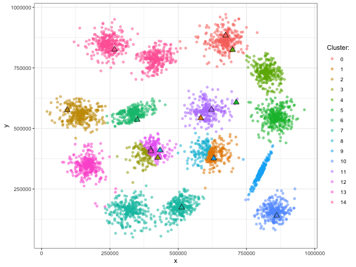

# optProject3

This project looks at two clusterin methods - K-means and MST. We code the two approaches up from scratch and compare their performance using standard performance measures. The animation below provides a flavour of the contents. It shows how centroids converge to their final positions as K-means are iteratively computed.

 
